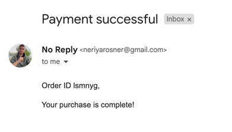

# NestJS Microservice Payment API

## Description

This is a microservice for providing payment functionality.

## Assignment

<details>
<summary>Click to expand</summary>

### Task

Create a simple microservice application using NestJS. The application should perform the following tasks: \
Expose a REST API method to initiate a payment. \
To create the payment use the payment service `POST /pay-ins/checkout` endpoint. \
check our docs for this assignment  (https://docs.unipaas.com/docs) \
The create payment method will return a link to a checkout page to the client who initiated the payment process. \
After the payment is completed, the application sends an email to the buyer confirming the payment.

### Deliverables

link to GitHub with the code. \
Optional: deploy the application to the cloud and send a link to the API reference.

Please note that the focus of this assignment is on demonstrating your hands-on skills, so feel free to use any \
available resources to help you complete the task. However, we expect that the code you submit will be your own original
work.
</details>

## Prerequisites

- Node

## API

<details>
<summary>Click to expand</summary>

### Payment

**POST /pay-ins/checkout**

```bash
curl --location --request POST 'http://localhost:3000/pay-ins/checkout' \
--header 'Content-Type: application/json' \
--header 'Authorization: Bearer {{PRIVATE_KEY}}' \
--data-raw '{
  "amount": 100,
  "currency": "GBP",
  "orderId": "1000456",
  "description": "Iphone case",
  "email": "test@test.com",
  "phone": "+447911123456",
  "country": "GB",
 "reference": "100456",
  "invoiceUrl": "http://yourcompany.com/invoice.pdf",
  "dueDate": "2020-12-13", //OPTIONAL
  "vatAmount": 19, //OPTIONAL
  "successfulPaymentRedirect": "http://yourcompany.com/redirect", //OPTIONAL
  "items": [
    {
      "name": "Iphone case",
      "amount": 100,
      "vendorId": "5ee8e655a65f08fcd71fe4d9",
      "platformFee": 0,
      "quantity": 1
    }
  ],
  "billingAddress": {
    "firstName": "string",
    "lastName": "string",
    "city": "London",
    "country": "GB",
    "line1": "64 New Cavendish Street",
    "line2": "",
    "postalCode": "W1G 8TB",
    "state": ""
  },
  "shippingSameAsBilling": true,
  "shippingAddress": {
    "firstName": "string",
    "lastName": "string",
    "city": "London",
    "country": "GB",
    "line1": "64 New Cavendish Street",
    "line2": "",
    "postalCode": "W1G 8TB", 
    "state": ""
  },
  "metadata": {
    "CustomerID": "457349"
  }
}'
```

In the response you will find the shortLink field, which contains the URL of the checkout page.

**Optional address fields**

In case shipping address is not applicable (for non-physical goods), set the shippingSameAsBilling flag to true.

Note: Add a 2-letter ISO state code (for customers based in the US, Canada, and India only).

</details>

## Result

Email sent

